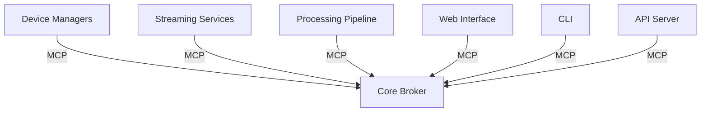
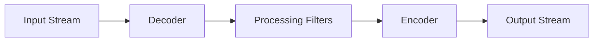
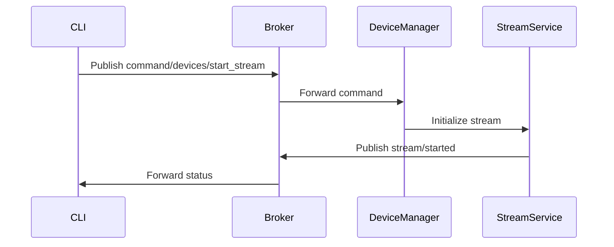

# [RTASPI - Real-Time Annotation and Stream Processing Interface](http://rt-asp.github.io/rtaspi/) [<span style='font-size:20px;'>&#x270D;</span>](git@github.com:rt-asp/rtaspi/edit/main/docs/README.md)

RTASPI is a powerful system for detecting, managing, and streaming from local and remote audio/video devices. It enables easy sharing of camera and microphone streams through various protocols (RTSP, RTMP, WebRTC) while providing real-time processing capabilities.

## Features

- **Device Management**
  - Automatic detection of local video (cameras) and audio (microphones) devices
  - Network device discovery (IP cameras, IP microphones) via ONVIF, UPnP, and mDNS
  - Unified device management interface

- **Streaming Capabilities**
  - Stream local devices via RTSP, RTMP, and WebRTC
  - Proxy streams from remote devices
  - Real-time stream transcoding
  - Multi-protocol support

- **Processing Features**
  - Real-time video filtering and effects
  - Audio processing and filters
  - Speech recognition capabilities
  - Object detection and tracking

- **Integration & Control**
  - RESTful API for remote control
  - Command-line interface (CLI)
  - Web interface for management
  - Module Communication Protocol (MCP) for inter-module communication

## Documentation

- [Installation Guide](INSTALL.md) - Detailed installation instructions
- [Core Concepts](CONCEPTS.md) - Understanding RTASPI's architecture and key concepts
- [Configuration Guide](CONFIGURATION.md) - How to configure RTASPI
- [API Reference](API.md) - REST API documentation
- [CLI Guide](CLI.md) - Command-line interface usage
- [Development Guide](DEVELOPMENT.md) - Contributing to RTASPI
- [Examples](EXAMPLES.md) - Usage examples and tutorials

## System Requirements

- Python 3.8 or newer
- FFmpeg 4.0 or newer
- GStreamer 1.14 or newer (for WebRTC)
- NGINX with RTMP module (for RTMP)

### System Dependencies

#### Ubuntu/Debian:
```bash
sudo apt update
sudo apt install ffmpeg gstreamer1.0-tools gstreamer1.0-plugins-base \
    gstreamer1.0-plugins-good gstreamer1.0-plugins-bad \
    gstreamer1.0-plugins-ugly nginx libnginx-mod-rtmp v4l-utils
```

#### macOS:
```bash
brew install ffmpeg gstreamer gst-plugins-base gst-plugins-good \
    gst-plugins-bad gst-plugins-ugly nginx
```

#### Windows:
Download and install:
- [FFmpeg](https://ffmpeg.org/download.html)
- [GStreamer](https://gstreamer.freedesktop.org/download/)
- [NGINX with RTMP module](https://github.com/illuspas/nginx-rtmp-win32)

## Quick Start

1. Install RTASPI:
```bash
pip install rtaspi
```

2. Create a configuration file (rtaspi.config.yaml):
```yaml
system:
  storage_path: 'storage'
  log_level: 'INFO'

local_devices:
  enable_video: true
  enable_audio: true
  auto_start: false
```

3. Start RTASPI:
```bash
rtaspi start
```

## License

This project is licensed under the Apache License 2.0 - see the [LICENSE](../LICENSE) file for details.

## Contributing

We welcome contributions! Please see our [Contributing Guide](CONTRIBUTING.md) for details.

# Usage Examples and Tutorials [<span style='font-size:20px;'>&#x270D;</span>](git@github.com:rt-asp/rtaspi/edit/main/docs/EXAMPLES.md)

This document provides practical examples and tutorials for common RTASPI use cases.

## Basic Examples

### 1. Stream from USB Webcam

```bash
# Start RTASPI
rtaspi start

# List available devices
rtaspi devices list

# Start RTSP stream from webcam
rtaspi streams start \
  --device video0 \
  --protocol rtsp \
  --path /webcam \
  --video-codec h264 \
  --video-bitrate 2M
```

Access the stream at: `rtsp://localhost:8554/webcam`

### 2. Connect IP Camera

```bash
# Add network camera
rtaspi devices add \
  --type network \
  --protocol rtsp \
  --address 192.168.1.100 \
  --port 554 \
  --username admin \
  --password secret

# Start WebRTC stream
rtaspi streams start \
  --device ipcam1 \
  --protocol webrtc \
  --path /camera1
```

Access the stream at: `http://localhost:8080/webrtc/camera1`

### 3. Record Audio from Microphone

```bash
# Start RTMP stream from microphone
rtaspi streams start \
  --device audio0 \
  --protocol rtmp \
  --path /mic \
  --audio-codec aac \
  --audio-bitrate 128k

# Record stream
rtaspi pipelines create \
  --input mic_stream \
  --config - <<EOF
output:
  - type: "record"
    format: "mp3"
    path: "recordings/"
EOF
```

## Advanced Examples

### 1. Motion Detection Pipeline

Create a pipeline that detects motion and sends notifications:

```yaml
# motion_detection.yaml
pipelines:
  - id: "security_cam"
    input:
      stream_id: "camera1"
    
    stages:
      - type: "motion_detector"
        sensitivity: 0.8
        region: [0, 0, 1920, 1080]
        min_area: 1000
      
      - type: "object_detector"
        model: "yolov3"
        confidence: 0.5
        classes: ["person", "car"]
      
      - type: "event_trigger"
        conditions:
          - type: "motion"
            duration: 5
          - type: "object"
            classes: ["person"]
    
    output:
      - type: "webhook"
        url: "http://localhost:8000/alerts"
      
      - type: "record"
        format: "mp4"
        duration: 30
        pre_buffer: 5
```

```bash
# Start the pipeline
rtaspi pipelines create --config motion_detection.yaml
```

### 2. Multi-Camera Setup

Stream from multiple cameras with different configurations:

```yaml
# multi_camera.yaml
streams:
  - id: "entrance_cam"
    device_id: "ipcam1"
    protocol: "rtsp"
    path: "/entrance"
    settings:
      video:
        codec: "h264"
        bitrate: "2M"
        framerate: 30
      audio:
        enabled: false
  
  - id: "parking_cam"
    device_id: "ipcam2"
    protocol: "rtmp"
    path: "/parking"
    settings:
      video:
        codec: "h264"
        bitrate: "1M"
        framerate: 15
      audio:
        enabled: false
  
  - id: "reception_cam"
    device_id: "video0"
    protocol: "webrtc"
    path: "/reception"
    settings:
      video:
        codec: "vp8"
        bitrate: "1.5M"
      audio:
        enabled: true
        codec: "opus"
```

```bash
# Start all streams
rtaspi streams start --config multi_camera.yaml
```

### 3. Video Processing Pipeline

Create a pipeline for real-time video processing:

```yaml
# video_processing.yaml
pipelines:
  - id: "video_effects"
    input:
      stream_id: "webcam_stream"
    
    stages:
      - type: "resize"
        width: 1280
        height: 720
      
      - type: "color_correction"
        brightness: 1.2
        contrast: 1.1
        saturation: 1.1
      
      - type: "overlay"
        text: "%timestamp%"
        position: [10, 10]
        font: "Arial"
        size: 24
      
      - type: "face_detection"
        model: "face_detection_v1"
        blur_faces: true
    
    output:
      - type: "rtmp"
        url: "rtmp://localhost/live/processed"
      
      - type: "webrtc"
        path: "/processed"
```

```bash
# Start the processing pipeline
rtaspi pipelines create --config video_processing.yaml
```

### 4. Audio Processing Pipeline

Create a pipeline for audio processing:

```yaml
# audio_processing.yaml
pipelines:
  - id: "audio_effects"
    input:
      stream_id: "mic_stream"
    
    stages:
      - type: "noise_reduction"
        strength: 0.7
      
      - type: "equalizer"
        bands:
          - frequency: 100
            gain: -3
          - frequency: 1000
            gain: 2
          - frequency: 8000
            gain: 1
      
      - type: "compressor"
        threshold: -20
        ratio: 4
        attack: 5
        release: 50
      
      - type: "speech_detection"
        language: "en"
        output_format: "srt"
    
    output:
      - type: "rtmp"
        url: "rtmp://localhost/live/processed_audio"
      
      - type: "file"
        path: "subtitles.srt"
```

```bash
# Start the audio processing pipeline
rtaspi pipelines create --config audio_processing.yaml
```

## Integration Examples

### 1. Web Application Integration

```javascript
// Connect to WebSocket API
const ws = new WebSocket('ws://localhost:8081/api/ws');

// Subscribe to events
ws.send(JSON.stringify({
  type: 'subscribe',
  topics: ['devices/status', 'streams/status']
}));

// Handle events
ws.onmessage = (event) => {
  const data = JSON.parse(event.data);
  switch(data.type) {
    case 'device_status':
      updateDeviceStatus(data);
      break;
    case 'stream_status':
      updateStreamStatus(data);
      break;
  }
};

// Start WebRTC stream
async function startStream(deviceId) {
  const response = await fetch('http://localhost:8081/api/streams', {
    method: 'POST',
    headers: {
      'Content-Type': 'application/json',
      'Authorization': 'Bearer ' + token
    },
    body: JSON.stringify({
      device_id: deviceId,
      protocol: 'webrtc',
      path: '/stream1'
    })
  });
  
  const data = await response.json();
  const player = new RTCPeerConnection();
  // ... WebRTC setup code ...
}
```

### 2. REST API Integration

Python example using requests:

```python
import requests

class RTASPIClient:
    def __init__(self, base_url, token):
        self.base_url = base_url
        self.headers = {'Authorization': f'Bearer {token}'}
    
    def list_devices(self):
        response = requests.get(
            f'{self.base_url}/api/devices',
            headers=self.headers
        )
        return response.json()
    
    def start_stream(self, device_id, protocol, path):
        response = requests.post(
            f'{self.base_url}/api/streams',
            headers=self.headers,
            json={
                'device_id': device_id,
                'protocol': protocol,
                'path': path
            }
        )
        return response.json()
    
    def create_pipeline(self, config):
        response = requests.post(
            f'{self.base_url}/api/pipelines',
            headers=self.headers,
            json=config
        )
        return response.json()

# Usage example
client = RTASPIClient('http://localhost:8081', 'your-token')

# List devices
devices = client.list_devices()

# Start stream
stream = client.start_stream('video0', 'rtsp', '/webcam')

# Create pipeline
pipeline = client.create_pipeline({
    'id': 'motion_detection',
    'input': {'stream_id': stream['id']},
    'stages': [
        {
            'type': 'motion_detector',
            'sensitivity': 0.8
        }
    ],
    'output': [
        {
            'type': 'webhook',
            'url': 'http://localhost:8000/events'
        }
    ]
})
```

### 3. System Service Integration

Create a systemd service for automatic startup:

1. Create service file `/etc/systemd/system/rtaspi.service`:
```ini
[Unit]
Description=RTASPI Service
After=network.target

[Service]
Type=simple
User=rtaspi
Environment=RTASPI_CONFIG=/etc/rtaspi/config.yaml
ExecStart=/usr/local/bin/rtaspi start
Restart=always
RestartSec=5

[Install]
WantedBy=multi-user.target
```

2. Create configuration in `/etc/rtaspi/config.yaml`:
```yaml
system:
  storage_path: "/var/lib/rtaspi"
  log_level: "INFO"

local_devices:
  enable_video: true
  enable_audio: true
  auto_start: true

streaming:
  rtsp:
    port_start: 8554
  rtmp:
    port_start: 1935
  webrtc:
    port_start: 8080
```

3. Setup and start service:
```bash
# Create rtaspi user
sudo useradd -r rtaspi

# Create directories
sudo mkdir -p /etc/rtaspi /var/lib/rtaspi
sudo chown -R rtaspi:rtaspi /etc/rtaspi /var/lib/rtaspi

# Enable and start service
sudo systemctl enable rtaspi
sudo systemctl start rtaspi
```

## Best Practices

1. **Resource Management**
   - Monitor system resources
   - Use appropriate video quality settings
   - Clean up unused streams and pipelines

2. **Security**
   - Use strong passwords
   - Enable SSL/TLS
   - Implement access control
   - Monitor access logs

3. **Performance**
   - Choose appropriate codecs
   - Set reasonable bitrates
   - Monitor network bandwidth
   - Use hardware acceleration when available

4. **Reliability**
   - Implement error handling
   - Set up automatic recovery
   - Monitor system health
   - Keep logs for troubleshooting

# Installation Guide [<span style='font-size:20px;'>&#x270D;</span>](git@github.com:rt-asp/rtaspi/edit/main/docs/INSTALL.md)

This guide covers the installation and initial setup of RTASPI.

## System Requirements

- Python 3.8 or newer
- FFmpeg 4.0 or newer
- GStreamer 1.14 or newer (for WebRTC support)
- NGINX with RTMP module (for RTMP support)

## Dependencies Installation

### Ubuntu/Debian

```bash
# Update package list
sudo apt update

# Install system dependencies
sudo apt install -y \
    python3 python3-pip python3-venv \
    ffmpeg \
    gstreamer1.0-tools \
    gstreamer1.0-plugins-base \
    gstreamer1.0-plugins-good \
    gstreamer1.0-plugins-bad \
    gstreamer1.0-plugins-ugly \
    nginx \
    libnginx-mod-rtmp \
    v4l-utils

# Install additional development libraries
sudo apt install -y \
    build-essential \
    python3-dev \
    libgstreamer1.0-dev \
    libgstreamer-plugins-base1.0-dev \
    libavcodec-dev \
    libavformat-dev \
    libswscale-dev
```

### macOS (using Homebrew)

```bash
# Install Homebrew if not already installed
/bin/bash -c "$(curl -fsSL https://raw.githubusercontent.com/Homebrew/install/HEAD/install.sh)"

# Install dependencies
brew install python@3.10
brew install ffmpeg
brew install gstreamer
brew install gst-plugins-base
brew install gst-plugins-good
brew install gst-plugins-bad
brew install gst-plugins-ugly
brew install nginx
```

### Windows

1. Install Python 3.8 or newer from [python.org](https://www.python.org/downloads/)

2. Install FFmpeg:
   - Download from [ffmpeg.org](https://ffmpeg.org/download.html)
   - Add to system PATH

3. Install GStreamer:
   - Download from [gstreamer.freedesktop.org](https://gstreamer.freedesktop.org/download/)
   - Select Complete installation
   - Add to system PATH

4. Install NGINX with RTMP module:
   - Download from [nginx-rtmp-win32](https://github.com/illuspas/nginx-rtmp-win32)

## RTASPI Installation

### 1. Create Virtual Environment

```bash
# Create virtual environment
python -m venv venv

# Activate virtual environment
# On Linux/macOS:
source venv/bin/activate
# On Windows:
venv\Scripts\activate
```

### 2. Install RTASPI

```bash
# Install from PyPI
pip install rtaspi

# Or install from source
git clone https://github.com/rt-asp/rtaspi.git
cd rtaspi
pip install -e .
```

### 3. Configuration

1. Create configuration directory:
```bash
# Linux/macOS
mkdir -p ~/.config/rtaspi

# Windows (PowerShell)
New-Item -ItemType Directory -Force -Path "$env:APPDATA\rtaspi"
```

2. Create basic configuration:
```yaml
# config.yaml
system:
  storage_path: "~/.local/share/rtaspi"  # Windows: %LOCALAPPDATA%\rtaspi
  log_level: "INFO"

local_devices:
  enable_video: true
  enable_audio: true
  auto_start: false

streaming:
  rtsp:
    port_start: 8554
  rtmp:
    port_start: 1935
  webrtc:
    port_start: 8080
    stun_server: "stun:stun.l.google.com:19302"
```

### 4. System Service Setup (Linux)

1. Create service file:
```bash
sudo tee /etc/systemd/system/rtaspi.service << 'EOF'
[Unit]
Description=RTASPI Service
After=network.target

[Service]
Type=simple
User=rtaspi
Environment=RTASPI_CONFIG=/etc/rtaspi/config.yaml
ExecStart=/usr/local/bin/rtaspi start
Restart=always
RestartSec=5

[Install]
WantedBy=multi-user.target
EOF
```

2. Create system user and directories:
```bash
# Create system user
sudo useradd -r rtaspi

# Create configuration directories
sudo mkdir -p /etc/rtaspi /var/lib/rtaspi
sudo chown -R rtaspi:rtaspi /etc/rtaspi /var/lib/rtaspi
```

3. Enable and start service:
```bash
sudo systemctl enable rtaspi
sudo systemctl start rtaspi
```

### 5. Verify Installation

1. Check RTASPI version:
```bash
rtaspi --version
```

2. List available devices:
```bash
rtaspi devices list
```

3. Check system status:
```bash
rtaspi status
```

## Troubleshooting

### Common Issues

1. **Missing Dependencies**
```bash
# Check Python version
python --version

# Check FFmpeg installation
ffmpeg -version

# Check GStreamer installation
gst-launch-1.0 --version
```

2. **Permission Issues**
```bash
# Add user to video group (Linux)
sudo usermod -a -G video $USER

# Check device permissions
ls -l /dev/video*
```

3. **Port Conflicts**
```bash
# Check if ports are in use
sudo netstat -tulpn | grep "8554\|1935\|8080"
```

### Debug Mode

Enable debug logging for troubleshooting:

```yaml
# config.yaml
system:
  log_level: "DEBUG"
  debug_mode: true
```

### Log Files

Check logs for detailed information:

```bash
# System service logs
sudo journalctl -u rtaspi

# Application logs
tail -f ~/.local/share/rtaspi/logs/rtaspi.log
```

## Next Steps

- Read the [Configuration Guide](CONFIGURATION.md) for detailed configuration options
- Check the [Examples](EXAMPLES.md) for common usage scenarios
- Explore the [API Reference](API.md) for programmatic control
- See the [CLI Guide](CLI.md) for command-line usage

# Core Concepts [<span style='font-size:20px;'>&#x270D;</span>](git@github.com:rt-asp/rtaspi/edit/main/docs/CONCEPTS.md)

This document explains the core concepts and architecture of RTASPI.

## Architecture Overview

RTASPI is built with a modular architecture where different components communicate through a central message broker using the Module Communication Protocol (MCP). Here's a high-level overview:



## Key Components

### 1. Device Managers

Device managers handle the discovery and management of audio/video devices:

- **Local Device Manager**: Manages USB cameras, webcams, and microphones connected directly to the system
- **Network Device Manager**: Handles IP cameras and network audio devices, supporting:
  - ONVIF protocol for IP cameras
  - UPnP for device discovery
  - mDNS for zero-configuration networking

### 2. Streaming Services

RTASPI supports multiple streaming protocols:

- **RTSP (Real Time Streaming Protocol)**
  - Ideal for low-latency streaming
  - Supports both server and client modes
  - Used for IP camera integration

- **RTMP (Real Time Messaging Protocol)**
  - Popular for streaming to services like YouTube, Twitch
  - Supports high-quality video delivery
  - Built-in NGINX-RTMP integration

- **WebRTC**
  - Browser-based real-time communication
  - Peer-to-peer capabilities
  - Low latency video conferencing features

### 3. Processing Pipeline

The processing pipeline enables real-time media processing:



Supported processing features:
- Video filters (resize, crop, rotate, etc.)
- Audio filters (normalize, noise reduction, etc.)
- Object detection
- Motion detection
- Speech recognition

### 4. Module Communication Protocol (MCP)

MCP is the backbone of RTASPI's inter-module communication:

- **Publish/Subscribe Pattern**: Modules communicate by publishing messages to topics and subscribing to receive messages
- **Message Types**:
  - Commands: Request actions from modules
  - Events: Notify about state changes
  - Data: Share information between modules
- **Topics Structure**:
  - `devices/*`: Device-related messages
  - `streams/*`: Streaming-related messages
  - `processing/*`: Processing pipeline messages
  - `command/*`: Control commands

Example MCP message flow:


### 5. Configuration System

RTASPI uses YAML-based configuration files:

- **rtaspi.config.yaml**: Main system configuration
- **rtaspi.devices.yaml**: Device configurations
- **rtaspi.streams.yaml**: Stream configurations
- **rtaspi.pipeline.yaml**: Processing pipeline configurations

### 6. Web Interface

The web interface provides:
- Device management dashboard
- Stream monitoring
- Pipeline configuration
- System statistics

### 7. CLI Tool

The command-line interface enables:
- System control
- Device management
- Stream control
- Pipeline management
- Configuration updates

### 8. API Server

RESTful API providing:
- Device control endpoints
- Stream management
- Pipeline configuration
- System monitoring

## Data Flow

1. **Device Discovery**:
   - Local devices are detected through system APIs
   - Network devices are discovered via protocols (ONVIF, UPnP, mDNS)
   - Device information is published to MCP

2. **Stream Management**:
   - Stream requests are sent via CLI/API/Web
   - Device manager initializes the device
   - Streaming service creates appropriate server/client
   - Processing pipeline is configured if needed

3. **Processing Pipeline**:
   - Input stream is decoded
   - Configured filters are applied
   - Processed stream is encoded
   - Output is sent to streaming service

## Best Practices

1. **Device Management**:
   - Regular device scanning intervals
   - Proper error handling for device disconnections
   - Automatic stream recovery

2. **Stream Handling**:
   - Buffer management for smooth playback
   - Adaptive bitrate when supported
   - Proper stream cleanup on termination

3. **Resource Management**:
   - CPU/memory monitoring
   - Stream quality vs resource usage balance
   - Proper cleanup of resources

4. **Security**:
   - Authentication for web/API access
   - Secure storage of device credentials
   - HTTPS/WSS for web interface

# CLI Guide [<span style='font-size:20px;'>&#x270D;</span>](git@github.com:rt-asp/rtaspi/edit/main/docs/CLI.md)

RTASPI provides a powerful command-line interface (CLI) for managing devices, streams, and pipelines. This guide covers all available commands and their usage.

## Installation

The CLI is automatically installed with RTASPI. You can verify the installation by running:

```bash
rtaspi --version
```

## Shell Completion

RTASPI supports shell completion for bash, zsh, and fish shells.

### Bash
```bash
source <(rtaspi completion bash)
# Add to ~/.bashrc for permanent installation
echo 'source <(rtaspi completion bash)' >> ~/.bashrc
```

### Zsh
```bash
source <(rtaspi completion zsh)
# Add to ~/.zshrc for permanent installation
echo 'source <(rtaspi completion zsh)' >> ~/.zshrc
```

### Fish
```bash
rtaspi completion fish > ~/.config/fish/completions/rtaspi.fish
```

## Global Options

- `--config, -c`: Path to configuration file (default: rtaspi.config.yaml)
- `--verbose, -v`: Enable verbose output
- `--quiet, -q`: Suppress output
- `--json`: Output in JSON format
- `--help, -h`: Show help message

## Commands

### System Management

#### Start RTASPI
```bash
rtaspi start [options]
```
Options:
- `--daemon`: Run in background
- `--log-file`: Path to log file
- `--pid-file`: Path to PID file

#### Stop RTASPI
```bash
rtaspi stop
```

#### Show System Status
```bash
rtaspi status
```

#### View Logs
```bash
rtaspi logs [options]
```
Options:
- `--level`: Log level (debug, info, warning, error)
- `--follow, -f`: Follow log output
- `--tail`: Number of lines to show
- `--since`: Show logs since timestamp

### Device Management

#### List Devices
```bash
rtaspi devices list [options]
```
Options:
- `--type`: Filter by device type (video, audio)
- `--status`: Filter by status (active, inactive)
- `--format`: Output format (table, json)

Example:
```bash
# List all video devices
rtaspi devices list --type video

# List active devices in JSON format
rtaspi devices list --status active --format json
```

#### Show Device Details
```bash
rtaspi devices show <device-id>
```

Example:
```bash
rtaspi devices show video0
```

#### Add Network Device
```bash
rtaspi devices add [options]
```
Options:
- `--type`: Device type (network)
- `--protocol`: Protocol (rtsp, onvif)
- `--address`: IP address
- `--port`: Port number
- `--username`: Username
- `--password`: Password

Example:
```bash
rtaspi devices add \
  --type network \
  --protocol rtsp \
  --address 192.168.1.100 \
  --port 554 \
  --username admin \
  --password secret
```

#### Update Device Settings
```bash
rtaspi devices update <device-id> [options]
```
Options:
- `--resolution`: Video resolution
- `--framerate`: Frame rate
- `--format`: Video format

Example:
```bash
rtaspi devices update video0 --resolution 1280x720 --framerate 30
```

#### Remove Device
```bash
rtaspi devices remove <device-id>
```

### Stream Management

#### List Streams
```bash
rtaspi streams list [options]
```
Options:
- `--protocol`: Filter by protocol (rtsp, rtmp, webrtc)
- `--status`: Filter by status (active, stopped)

#### Show Stream Details
```bash
rtaspi streams show <stream-id>
```

#### Start Stream
```bash
rtaspi streams start [options]
```
Options:
- `--device`: Device ID
- `--protocol`: Streaming protocol
- `--path`: Stream path
- `--video-codec`: Video codec
- `--video-bitrate`: Video bitrate
- `--audio-enabled`: Enable audio

Example:
```bash
rtaspi streams start \
  --device video0 \
  --protocol rtsp \
  --path /webcam \
  --video-codec h264 \
  --video-bitrate 2M
```

#### Stop Stream
```bash
rtaspi streams stop <stream-id>
```

### Pipeline Management

#### List Pipelines
```bash
rtaspi pipelines list
```

#### Show Pipeline Details
```bash
rtaspi pipelines show <pipeline-id>
```

#### Create Pipeline
```bash
rtaspi pipelines create [options]
```
Options:
- `--input`: Input stream ID
- `--config`: Pipeline configuration file

Example:
```bash
rtaspi pipelines create \
  --input webcam_stream \
  --config pipeline.yaml
```

#### Delete Pipeline
```bash
rtaspi pipelines delete <pipeline-id>
```

### Configuration Management

#### Show Current Configuration
```bash
rtaspi config show [section]
```

Example:
```bash
# Show all configuration
rtaspi config show

# Show specific section
rtaspi config show streaming
```

#### Update Configuration
```bash
rtaspi config set <key> <value>
```

Example:
```bash
rtaspi config set streaming.rtsp.port_start 8554
```

#### Validate Configuration
```bash
rtaspi config validate [file]
```

### Development Tools

#### Generate API Client
```bash
rtaspi dev generate-client [options]
```
Options:
- `--language`: Target language (python, javascript)
- `--output`: Output directory

#### Run Tests
```bash
rtaspi dev test [options]
```
Options:
- `--unit`: Run unit tests
- `--integration`: Run integration tests
- `--coverage`: Generate coverage report

#### Profile Performance
```bash
rtaspi dev profile [options]
```
Options:
- `--duration`: Profile duration
- `--output`: Output file

## Examples

### Basic Usage

1. Start RTASPI:
```bash
rtaspi start
```

2. List available devices:
```bash
rtaspi devices list
```

3. Start streaming from a webcam:
```bash
rtaspi streams start \
  --device video0 \
  --protocol rtsp \
  --path /webcam
```

### Advanced Usage

1. Create a motion detection pipeline:
```bash
rtaspi pipelines create \
  --input webcam_stream \
  --config - <<EOF
stages:
  - type: motion_detector
    sensitivity: 0.8
  - type: object_detector
    model: yolov3
output:
  - type: webhook
    url: http://localhost:8000/events
EOF
```

2. Monitor system status and logs:
```bash
# Show system status
rtaspi status

# Follow logs
rtaspi logs -f --level info
```

3. Manage multiple streams:
```bash
# Start multiple streams
rtaspi streams start --device video0 --protocol rtsp --path /cam1
rtaspi streams start --device video1 --protocol webrtc --path /cam2

# List active streams
rtaspi streams list --status active
```

## Best Practices

1. **Shell Completion**: Install shell completion for improved productivity

2. **JSON Output**: Use `--json` for scripting and automation:
```bash
rtaspi devices list --json | jq '.devices[].id'
```

3. **Configuration Management**:
- Keep configuration files under version control
- Use environment variables for sensitive information
- Regularly validate configuration files

4. **Logging**:
- Use appropriate log levels for different environments
- Rotate log files to manage disk space
- Monitor logs for errors and warnings

5. **Resource Management**:
- Monitor system resources with `rtaspi status`
- Clean up unused streams and pipelines
- Use appropriate video quality settings

6. **Security**:
- Use strong passwords for network devices
- Enable SSL for production deployments
- Regularly update RTASPI and dependencies

# API Reference [<span style='font-size:20px;'>&#x270D;</span>](git@github.com:rt-asp/rtaspi/edit/main/docs/API.md)

RTASPI provides a comprehensive RESTful API for managing devices, streams, and pipelines. This document details all available endpoints and their usage.

## Authentication

The API uses JWT (JSON Web Token) authentication. To access protected endpoints:

1. Obtain a token:
```bash
curl -X POST http://localhost:8081/api/auth/token \
  -H "Content-Type: application/json" \
  -d '{"username": "admin", "password": "your-password"}'
```

2. Use the token in subsequent requests:
```bash
curl -H "Authorization: Bearer your-token" http://localhost:8081/api/devices
```

## Device Management

### List Devices
```http
GET /api/devices
```

Response:
```json
{
  "devices": [
    {
      "id": "video0",
      "type": "video",
      "name": "Webcam",
      "status": "active",
      "capabilities": {
        "resolutions": ["1920x1080", "1280x720"],
        "formats": ["YUYV", "MJPG"]
      }
    }
  ]
}
```

### Get Device Details
```http
GET /api/devices/{device_id}
```

Response:
```json
{
  "id": "video0",
  "type": "video",
  "name": "Webcam",
  "path": "/dev/video0",
  "status": "active",
  "settings": {
    "resolution": "1920x1080",
    "framerate": 30,
    "format": "YUYV"
  },
  "capabilities": {
    "resolutions": ["1920x1080", "1280x720"],
    "formats": ["YUYV", "MJPG"],
    "framerates": [30, 60]
  }
}
```

### Add Network Device
```http
POST /api/devices
```

Request:
```json
{
  "type": "network",
  "protocol": "rtsp",
  "address": "192.168.1.100",
  "port": 554,
  "path": "/stream1",
  "username": "admin",
  "password": "password"
}
```

### Update Device Settings
```http
PATCH /api/devices/{device_id}
```

Request:
```json
{
  "settings": {
    "resolution": "1280x720",
    "framerate": 60
  }
}
```

### Remove Device
```http
DELETE /api/devices/{device_id}
```

## Stream Management

### List Streams
```http
GET /api/streams
```

Response:
```json
{
  "streams": [
    {
      "id": "webcam_stream",
      "device_id": "video0",
      "protocol": "rtsp",
      "status": "active",
      "url": "rtsp://localhost:8554/webcam"
    }
  ]
}
```

### Get Stream Details
```http
GET /api/streams/{stream_id}
```

Response:
```json
{
  "id": "webcam_stream",
  "device_id": "video0",
  "protocol": "rtsp",
  "status": "active",
  "url": "rtsp://localhost:8554/webcam",
  "settings": {
    "video": {
      "codec": "h264",
      "bitrate": "2M",
      "framerate": 30
    },
    "audio": {
      "enabled": false
    }
  },
  "stats": {
    "uptime": 3600,
    "bytes_sent": 1024000,
    "clients_connected": 2
  }
}
```

### Start Stream
```http
POST /api/streams
```

Request:
```json
{
  "device_id": "video0",
  "protocol": "rtsp",
  "path": "/webcam",
  "settings": {
    "video": {
      "codec": "h264",
      "bitrate": "2M"
    },
    "audio": {
      "enabled": false
    }
  }
}
```

### Update Stream Settings
```http
PATCH /api/streams/{stream_id}
```

Request:
```json
{
  "settings": {
    "video": {
      "bitrate": "4M"
    }
  }
}
```

### Stop Stream
```http
DELETE /api/streams/{stream_id}
```

## Pipeline Management

### List Pipelines
```http
GET /api/pipelines
```

Response:
```json
{
  "pipelines": [
    {
      "id": "motion_detection",
      "status": "running",
      "input": {
        "stream_id": "webcam_stream"
      }
    }
  ]
}
```

### Get Pipeline Details
```http
GET /api/pipelines/{pipeline_id}
```

Response:
```json
{
  "id": "motion_detection",
  "status": "running",
  "input": {
    "stream_id": "webcam_stream"
  },
  "stages": [
    {
      "type": "motion_detector",
      "settings": {
        "sensitivity": 0.8,
        "region": [0, 0, 1920, 1080]
      }
    }
  ],
  "output": [
    {
      "type": "webhook",
      "url": "http://localhost:8000/events"
    }
  ],
  "stats": {
    "uptime": 3600,
    "events_triggered": 10,
    "last_event": "2025-04-29T08:15:30Z"
  }
}
```

### Create Pipeline
```http
POST /api/pipelines
```

Request:
```json
{
  "id": "motion_detection",
  "input": {
    "stream_id": "webcam_stream"
  },
  "stages": [
    {
      "type": "motion_detector",
      "sensitivity": 0.8,
      "region": [0, 0, 1920, 1080]
    },
    {
      "type": "object_detector",
      "model": "yolov3",
      "confidence": 0.5
    }
  ],
  "output": [
    {
      "type": "webhook",
      "url": "http://localhost:8000/events"
    }
  ]
}
```

### Update Pipeline
```http
PATCH /api/pipelines/{pipeline_id}
```

Request:
```json
{
  "stages": [
    {
      "type": "motion_detector",
      "sensitivity": 0.9
    }
  ]
}
```

### Delete Pipeline
```http
DELETE /api/pipelines/{pipeline_id}
```

## System Management

### Get System Status
```http
GET /api/system/status
```

Response:
```json
{
  "version": "1.0.0",
  "uptime": 3600,
  "components": {
    "web_interface": "running",
    "api_server": "running",
    "device_manager": "running"
  },
  "resources": {
    "cpu_usage": 25.5,
    "memory_usage": 512.0,
    "disk_usage": 1024.0
  }
}
```

### Get System Logs
```http
GET /api/system/logs
```

Query Parameters:
- `level`: Log level (debug, info, warning, error)
- `start`: Start timestamp
- `end`: End timestamp
- `limit`: Maximum number of logs to return

Response:
```json
{
  "logs": [
    {
      "timestamp": "2025-04-29T08:00:00Z",
      "level": "info",
      "component": "device_manager",
      "message": "New device detected: video0"
    }
  ]
}
```

### Update System Configuration
```http
PATCH /api/system/config
```

Request:
```json
{
  "system": {
    "log_level": "DEBUG"
  },
  "streaming": {
    "rtsp": {
      "port_start": 8654
    }
  }
}
```

## WebSocket API

RTASPI also provides a WebSocket API for real-time updates.

### Connect to WebSocket
```javascript
const ws = new WebSocket('ws://localhost:8081/api/ws');
```

### Subscribe to Events
```javascript
ws.send(JSON.stringify({
  type: 'subscribe',
  topics: [
    'devices/status',
    'streams/status',
    'pipelines/events'
  ]
}));
```

### Event Examples

Device Status Change:
```json
{
  "type": "device_status",
  "device_id": "video0",
  "status": "active",
  "timestamp": "2025-04-29T08:00:00Z"
}
```

Stream Status Update:
```json
{
  "type": "stream_status",
  "stream_id": "webcam_stream",
  "status": "streaming",
  "clients_connected": 2,
  "timestamp": "2025-04-29T08:00:00Z"
}
```

Pipeline Event:
```json
{
  "type": "pipeline_event",
  "pipeline_id": "motion_detection",
  "event": {
    "type": "motion_detected",
    "region": [100, 100, 200, 200],
    "confidence": 0.85
  },
  "timestamp": "2025-04-29T08:00:00Z"
}
```

## Error Handling

The API uses standard HTTP status codes and returns detailed error messages:

```json
{
  "error": {
    "code": "DEVICE_NOT_FOUND",
    "message": "Device with ID 'video0' not found",
    "details": {
      "device_id": "video0"
    }
  }
}
```

Common status codes:
- 200: Success
- 201: Created
- 400: Bad Request
- 401: Unauthorized
- 403: Forbidden
- 404: Not Found
- 409: Conflict
- 500: Internal Server Error

## Rate Limiting

The API implements rate limiting to prevent abuse:

```http
HTTP/1.1 429 Too Many Requests
X-RateLimit-Limit: 100
X-RateLimit-Remaining: 0
X-RateLimit-Reset: 1619683200
```

## Versioning

The API version is included in the response headers:

```http
X-API-Version: 1.0.0
```

## CORS

The API supports Cross-Origin Resource Sharing (CORS) for web client integration:

```http
Access-Control-Allow-Origin: *
Access-Control-Allow-Methods: GET, POST, PUT, PATCH, DELETE
Access-Control-Allow-Headers: Content-Type, Authorization

# Configuration Guide [<span style='font-size:20px;'>&#x270D;</span>](git@github.com:rt-asp/rtaspi/edit/main/docs/CONFIGURATION.md)

RTASPI uses YAML configuration files to manage its settings. This guide explains all available configuration options.

## Configuration Files

RTASPI uses several configuration files:

1. **rtaspi.config.yaml**: Main system configuration
2. **rtaspi.devices.yaml**: Device-specific settings
3. **rtaspi.streams.yaml**: Stream configurations
4. **rtaspi.pipeline.yaml**: Processing pipeline settings
5. **rtaspi.secrets.yaml**: Sensitive information (credentials, tokens)

## Main Configuration (rtaspi.config.yaml)

### System Settings
```yaml
system:
  # Base directory for storing temporary files, logs, etc.
  storage_path: "storage"
  
  # Logging level (DEBUG, INFO, WARNING, ERROR)
  log_level: "INFO"
  
  # Enable/disable system components
  components:
    web_interface: true
    api_server: true
    cli: true
```

### Local Device Settings
```yaml
local_devices:
  # Enable/disable device types
  enable_video: true
  enable_audio: true
  
  # Auto-start streams when devices are detected
  auto_start: false
  
  # Device scanning interval (seconds)
  scan_interval: 60
  
  # Starting ports for different protocols
  rtsp_port_start: 8554
  rtmp_port_start: 1935
  webrtc_port_start: 8080
  
  # Device-specific settings
  video_settings:
    default_resolution: "1280x720"
    default_framerate: 30
  
  audio_settings:
    default_sample_rate: 44100
    default_channels: 2
```

### Network Device Settings
```yaml
network_devices:
  # Enable network device support
  enable: true
  
  # Device scanning interval (seconds)
  scan_interval: 60
  
  # Discovery settings
  discovery:
    enabled: true
    methods:
      - "onvif"
      - "upnp"
      - "mdns"
    
  # Protocol port ranges
  rtsp_port_start: 8654
  rtmp_port_start: 2935
  webrtc_port_start: 9080
```

### Streaming Settings
```yaml
streaming:
  rtsp:
    # RTSP server settings
    port_start: 8554
    transport: ["tcp", "udp"]
    
  rtmp:
    # RTMP server settings
    port_start: 1935
    chunk_size: 4096
    
  webrtc:
    # WebRTC settings
    port_start: 8080
    stun_server: "stun://stun.l.google.com:19302"
    turn_server: ""
    turn_username: ""
    turn_password: ""
```

### Processing Settings
```yaml
processing:
  # Video processing settings
  video:
    enable_gpu: true
    default_codec: "h264"
    
  # Audio processing settings
  audio:
    enable_noise_reduction: true
    default_codec: "aac"
    
  # Pipeline settings
  pipeline:
    buffer_size: 10
    max_parallel: 4
```

### Web Interface Settings
```yaml
web:
  # HTTP server settings
  host: "0.0.0.0"
  port: 8080
  
  # Security settings
  ssl:
    enabled: false
    cert_file: ""
    key_file: ""
  
  # Authentication
  auth:
    enabled: true
    type: "basic"  # basic, jwt
```

### API Settings
```yaml
api:
  # API server settings
  host: "0.0.0.0"
  port: 8081
  
  # Security settings
  auth:
    enabled: true
    type: "jwt"
    token_expiry: 3600
```

## Device Configuration (rtaspi.devices.yaml)

### Local Device Example
```yaml
devices:
  local:
    - id: "video0"
      type: "video"
      path: "/dev/video0"
      name: "Webcam"
      settings:
        resolution: "1920x1080"
        framerate: 30
        format: "YUYV"
    
    - id: "audio0"
      type: "audio"
      path: "hw:0,0"
      name: "Microphone"
      settings:
        sample_rate: 48000
        channels: 2
        format: "S16LE"
```

### Network Device Example
```yaml
devices:
  network:
    - id: "ipcam1"
      type: "video"
      protocol: "rtsp"
      address: "192.168.1.100"
      port: 554
      path: "/stream1"
      username: "${IPCAM1_USER}"  # References secrets file
      password: "${IPCAM1_PASS}"
      settings:
        profile: "high"
```

## Stream Configuration (rtaspi.streams.yaml)

```yaml
streams:
  - id: "webcam_stream"
    device_id: "video0"
    protocol: "rtsp"
    path: "/webcam"
    settings:
      video:
        codec: "h264"
        bitrate: "2M"
      audio:
        enabled: false
    
  - id: "ipcam_proxy"
    device_id: "ipcam1"
    protocol: "webrtc"
    path: "/camera1"
    processing:
      - type: "resize"
        width: 1280
        height: 720
      - type: "object_detection"
        model: "yolov3"
```

## Pipeline Configuration (rtaspi.pipeline.yaml)

```yaml
pipelines:
  - id: "motion_detection"
    input:
      stream_id: "ipcam_proxy"
    stages:
      - type: "motion_detector"
        sensitivity: 0.8
        region: [0, 0, 1920, 1080]
      
      - type: "object_detector"
        model: "yolov3"
        confidence: 0.5
        
      - type: "event_trigger"
        conditions:
          - type: "motion"
            duration: 5
          - type: "object"
            classes: ["person", "car"]
    
    output:
      - type: "webhook"
        url: "http://localhost:8000/events"
      - type: "record"
        format: "mp4"
        duration: 30
```

## Secrets Configuration (rtaspi.secrets.yaml)

```yaml
secrets:
  # Device credentials
  IPCAM1_USER: "admin"
  IPCAM1_PASS: "password123"
  
  # API tokens
  API_SECRET_KEY: "your-secret-key"
  
  # External service credentials
  CLOUD_STORAGE_KEY: "your-storage-key"
```

## Environment Variables

Configuration values can reference environment variables using `${VAR_NAME}` syntax. This is particularly useful for sensitive information:

```yaml
api:
  auth:
    secret_key: "${API_SECRET_KEY}"
```

## Best Practices

1. **Security**:
   - Keep sensitive information in rtaspi.secrets.yaml
   - Use environment variables for deployment-specific settings
   - Enable SSL for production deployments

2. **Performance**:
   - Adjust buffer sizes based on available memory
   - Enable GPU processing if available
   - Set appropriate scan intervals

3. **Maintenance**:
   - Regular backup of configuration files
   - Version control for configuration changes
   - Documentation of custom settings

4. **Troubleshooting**:
   - Set log_level to DEBUG for detailed logging
   - Monitor resource usage
   - Regular validation of configuration files

# Development Guide [<span style='font-size:20px;'>&#x270D;</span>](git@github.com:rt-asp/rtaspi/edit/main/docs/DEVELOPMENT.md)

This guide provides information for developers who want to contribute to RTASPI or extend its functionality.

## Development Environment Setup

1. **Clone the Repository**
```bash
git clone https://github.com/rt-asp/rtaspi.git
cd rtaspi
```

2. **Create Virtual Environment**
```bash
python -m venv venv
source venv/bin/activate  # Linux/macOS
venv\Scripts\activate     # Windows
```

3. **Install Development Dependencies**
```bash
pip install -r requirements-dev.txt
```

4. **Install Pre-commit Hooks**
```bash
pre-commit install
```

## Project Structure

```
rtaspi/
├── docs/               # Documentation
├── examples/           # Example configurations and scripts
├── scripts/           # Development and maintenance scripts
├── src/               # Source code
│   └── rtaspi/
│       ├── api/       # REST API implementation
│       ├── cli/       # Command-line interface
│       ├── core/      # Core functionality
│       ├── device_managers/  # Device management
│       ├── processing/      # Stream processing
│       ├── schemas/   # Data models and validation
│       ├── streaming/ # Streaming protocols
│       └── web/       # Web interface
├── tests/             # Test suite
└── tools/             # Development tools
```

## Code Style

RTASPI follows PEP 8 with some modifications:

- Line length: 100 characters
- Docstring style: Google
- Import order: stdlib, third-party, local
- Type hints: Required for public interfaces

Example:
```python
from typing import List, Optional
import os
import sys

import numpy as np
from pydantic import BaseModel

from rtaspi.core.types import DeviceID
from rtaspi.schemas.device import Device


class StreamConfig(BaseModel):
    """Configuration for a media stream.

    Args:
        device_id: ID of the source device
        protocol: Streaming protocol to use
        path: Stream path/endpoint
        settings: Optional stream settings

    Raises:
        ValueError: If protocol is invalid
    """
    device_id: DeviceID
    protocol: str
    path: str
    settings: Optional[dict] = None

    def validate_protocol(self) -> None:
        """Validate the streaming protocol.

        Raises:
            ValueError: If protocol is not supported
        """
        valid_protocols = ["rtsp", "rtmp", "webrtc"]
        if self.protocol not in valid_protocols:
            raise ValueError(f"Invalid protocol: {self.protocol}")
```

## Testing

### Running Tests

```bash
# Run all tests
pytest

# Run specific test file
pytest tests/test_discovery.py

# Run tests with coverage
pytest --cov=rtaspi

# Run tests in parallel
pytest -n auto
```

### Writing Tests

Use pytest fixtures and parametrize for clean, maintainable tests:

```python
import pytest
from rtaspi.device_managers.discovery import DeviceDiscovery

@pytest.fixture
def discovery():
    """Create a DeviceDiscovery instance for testing."""
    return DeviceDiscovery()

@pytest.mark.parametrize("protocol,expected", [
    ("rtsp", True),
    ("invalid", False),
])
def test_protocol_validation(discovery, protocol, expected):
    """Test protocol validation logic."""
    assert discovery.is_valid_protocol(protocol) == expected
```

## Documentation

### Building Documentation

```bash
# Install documentation dependencies
pip install -r docs/requirements.txt

# Build documentation
cd docs
make html
```

### Writing Documentation

- Use clear, concise language
- Include code examples
- Document exceptions and edge cases
- Keep API documentation up-to-date
- Add diagrams where helpful

## Debugging

### Logging

```python
from rtaspi.core.logging import get_logger

logger = get_logger(__name__)

logger.debug("Detailed information")
logger.info("General information")
logger.warning("Warning message")
logger.error("Error message", exc_info=True)
```

### Debugging Tools

1. **Interactive Debugger**
```python
import pdb; pdb.set_trace()
```

2. **Debug Configuration**
```yaml
system:
  log_level: "DEBUG"
  debug_mode: true
```

3. **Performance Profiling**
```bash
python -m cProfile -o profile.stats your_script.py
python -m pstats profile.stats
```

## Contributing

### Workflow

1. **Fork and Clone**
```bash
git clone https://github.com/your-username/rtaspi.git
```

2. **Create Feature Branch**
```bash
git checkout -b feature/your-feature-name
```

3. **Make Changes**
- Write code
- Add tests
- Update documentation

4. **Run Quality Checks**
```bash
# Run linter
flake8 src tests

# Run type checker
mypy src

# Run tests
pytest

# Run pre-commit hooks
pre-commit run --all-files
```

5. **Commit Changes**
```bash
git add .
git commit -m "feat: add your feature description"
```

6. **Push and Create Pull Request**
```bash
git push origin feature/your-feature-name
```

### Commit Message Format

Follow conventional commits:

- feat: New feature
- fix: Bug fix
- docs: Documentation changes
- style: Code style changes
- refactor: Code refactoring
- test: Test changes
- chore: Build/maintenance changes

Example:
```
feat(streaming): add WebRTC support

- Add WebRTC streaming capability
- Implement STUN/TURN configuration
- Add WebRTC stream tests
```

## Extension Points

### Adding New Device Types

1. Create new device manager class:
```python
from rtaspi.device_managers.base import DeviceManager

class CustomDeviceManager(DeviceManager):
    """Custom device manager implementation."""

    def discover_devices(self):
        """Implement device discovery logic."""
        pass

    def start_device(self, device_id: str):
        """Implement device start logic."""
        pass
```

2. Register device manager:
```python
from rtaspi.core.registry import register_device_manager

register_device_manager("custom", CustomDeviceManager)
```

### Adding Processing Filters

1. Create new filter class:
```python
from rtaspi.processing.base import Filter

class CustomFilter(Filter):
    """Custom video/audio filter implementation."""

    def process_frame(self, frame):
        """Implement frame processing logic."""
        pass
```

2. Register filter:
```python
from rtaspi.core.registry import register_filter

register_filter("custom", CustomFilter)
```

### Adding Stream Protocols

1. Create new protocol handler:
```python
from rtaspi.streaming.base import StreamHandler

class CustomProtocolHandler(StreamHandler):
    """Custom streaming protocol implementation."""

    def start_stream(self, config):
        """Implement stream start logic."""
        pass

    def stop_stream(self):
        """Implement stream stop logic."""
        pass
```

2. Register protocol:
```python
from rtaspi.core.registry import register_protocol

register_protocol("custom", CustomProtocolHandler)
```

## Performance Optimization

### Memory Management

- Use generators for large datasets
- Implement proper cleanup in `__del__` methods
- Monitor memory usage with `memory_profiler`

### CPU Optimization

- Use numpy for numerical operations
- Implement caching where appropriate
- Profile code to identify bottlenecks

### GPU Acceleration

- Use CUDA when available
- Implement fallback for CPU-only systems
- Profile GPU memory usage

## Deployment

### Building Packages

```bash
# Build wheel
python setup.py bdist_wheel

# Build source distribution
python setup.py sdist
```

### Creating System Service

1. Create service file:
```ini
[Unit]
Description=RTASPI Service
After=network.target

[Service]
Type=simple
User=rtaspi
ExecStart=/usr/local/bin/rtaspi start
Restart=always

[Install]
WantedBy=multi-user.target
```

2. Install service:
```bash
sudo cp rtaspi.service /etc/systemd/system/
sudo systemctl enable rtaspi
sudo systemctl start rtaspi
```

## Troubleshooting

### Common Issues

1. **Device Detection**
- Check device permissions
- Verify hardware compatibility
- Check system logs

2. **Streaming Issues**
- Verify network connectivity
- Check port availability
- Monitor system resources

3. **Performance Problems**
- Profile code execution
- Monitor resource usage
- Check for memory leaks

### Debug Tools

1. **System Information**
```bash
rtaspi dev debug-info
```

2. **Connection Testing**
```bash
rtaspi dev test-connection
```

3. **Resource Monitoring**
```bash
rtaspi dev monitor
```

## Security Considerations

1. **Input Validation**
- Validate all user input
- Sanitize file paths
- Check parameter bounds

2. **Authentication**
- Use secure password storage
- Implement rate limiting
- Use HTTPS for web interface

3. **Device Access**
- Implement device access control
- Validate device credentials
- Monitor device access logs

## Best Practices

1. **Code Quality**
- Write comprehensive tests
- Document public interfaces
- Follow type hints
- Keep functions focused

2. **Performance**
- Profile before optimizing
- Use appropriate data structures
- Implement caching strategically

3. **Security**
- Review security implications
- Keep dependencies updated
- Follow security best practices

4. **Maintenance**
- Keep documentation updated
- Review and update dependencies
- Monitor system health

# Project Structure [<span style='font-size:20px;'>&#x270D;</span>](git@github.com:rt-asp/rtaspi/edit/main/docs/TREE.md)

This document provides an overview of RTASPI's directory structure and organization.

## Root Directory

```
rtaspi/
├── docs/               # Documentation
├── examples/           # Example configurations and scripts
├── install/            # Installation scripts and guides
├── scripts/           # Maintenance and setup scripts
├── service/           # System service scripts
├── src/               # Source code
├── tests/             # Test suite
└── update/            # Update and maintenance tools
```

## Source Code Structure

```
src/rtaspi/
├── api/               # REST API implementation
│   ├── devices.py     # Device management endpoints
│   ├── pipelines.py   # Pipeline management endpoints
│   ├── server.py      # API server implementation
│   └── streams.py     # Stream management endpoints
│
├── cli/               # Command-line interface
│   ├── commands/      # CLI command implementations
│   ├── completion/    # Shell completion scripts
│   └── shell.py       # CLI shell implementation
│
├── core/              # Core functionality
│   ├── config.py      # Configuration management
│   ├── logging.py     # Logging system
│   ├── mcp.py         # Module Communication Protocol
│   └── utils.py       # Utility functions
│
├── device_managers/   # Device management
│   ├── base.py        # Base device manager class
│   ├── local_devices.py    # Local device management
│   ├── network_devices.py  # Network device management
│   └── utils/        # Device management utilities
│
├── dsl/               # Domain Specific Language
│   ├── executor.py    # DSL execution engine
│   ├── lexer.py       # DSL lexical analyzer
│   └── parser.py      # DSL parser
│
├── processing/        # Stream processing
│   ├── audio/        # Audio processing
│   │   ├── filters.py   # Audio filters
│   │   └── speech.py    # Speech recognition
│   ├── video/        # Video processing
│   │   ├── detection.py # Object detection
│   │   └── filters.py   # Video filters
│   └── pipeline_executor.py  # Processing pipeline
│
├── quick/            # Quick access utilities
│   ├── camera.py     # Camera utilities
│   ├── microphone.py # Microphone utilities
│   └── utils.py      # Quick access helpers
│
├── schemas/          # Data models and validation
│   ├── device.py     # Device schemas
│   ├── pipeline.py   # Pipeline schemas
│   └── stream.py     # Stream schemas
│
├── streaming/        # Streaming protocols
│   ├── rtmp.py       # RTMP implementation
│   ├── rtsp.py       # RTSP implementation
│   ├── webrtc.py     # WebRTC implementation
│   └── utils.py      # Streaming utilities
│
└── web/             # Web interface
    ├── acme.py       # ACME protocol support
    ├── api.py        # Web API implementation
    ├── interface.py  # Web interface
    └── server.py     # Web server
```

## Documentation Structure

```
docs/
├── API.md            # REST API reference
├── CLI.md            # Command-line interface guide
├── CONCEPTS.md       # Architecture and core concepts
├── CONFIGURATION.md  # Configuration guide
├── DEVELOPMENT.md    # Development guide
├── EXAMPLES.md       # Usage examples and tutorials
├── INSTALL.md        # Installation guide
├── README.md         # Project overview
└── TREE.md          # This file
```

## Scripts and Tools

```
scripts/
├── configure_hardware.sh  # Hardware configuration
├── install_models.sh      # ML model installation
├── optimize_rpi.sh        # Raspberry Pi optimization
├── publish.sh            # Package publishing
├── setup_service.sh      # Service setup
└── upgrade.sh            # System upgrade

service/
├── start.sh             # Service start script
└── stop.sh              # Service stop script

update/
├── requirements.py      # Dependencies update
└── versions.py         # Version management
```

## Configuration Files

```
rtaspi/
├── rtaspi.config.yaml    # Main configuration
├── rtaspi.devices.yaml   # Device configuration
├── rtaspi.pipeline.yaml  # Pipeline configuration
├── rtaspi.secrets.yaml   # Sensitive information
└── rtaspi.streams.yaml   # Stream configuration
```

## Development Files

```
rtaspi/
├── pyproject.toml       # Project metadata
├── setup.cfg           # Package configuration
├── setup.py            # Package setup
├── requirements.txt    # Dependencies
├── MANIFEST.in         # Package manifest
└── Makefile           # Build automation
```

## Key Directories

- **src/rtaspi/**: Main source code
  - Core functionality and implementations
  - Modular architecture with clear separation of concerns
  - Each module focuses on specific functionality

- **docs/**: Documentation
  - Comprehensive guides and references
  - Examples and tutorials
  - Architecture documentation

- **tests/**: Test suite
  - Unit tests
  - Integration tests
  - Test fixtures and utilities

- **scripts/**: Utility scripts
  - Installation and setup
  - System optimization
  - Maintenance tools

- **service/**: System service
  - Service management scripts
  - System integration

## File Organization

The project follows a modular structure where:

1. Each major feature has its own directory
2. Related functionality is grouped together
3. Common utilities are centralized
4. Configuration is separated from code
5. Documentation is comprehensive and organized

This structure enables:

- Easy navigation
- Clear separation of concerns
- Modular development
- Simple maintenance
- Straightforward testing

---
+ Modular Documentation made possible by the [FlatEdit](http://www.flatedit.com) project.
