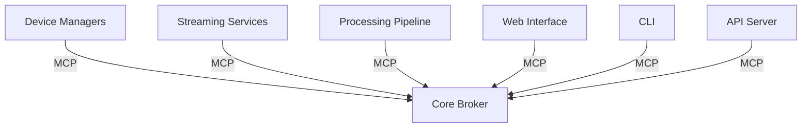
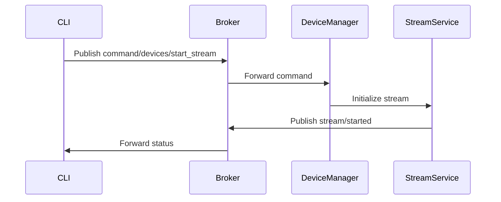

# Core Concepts

This document explains the core concepts and architecture of RTASPI.

## Architecture Overview

RTASPI is built with a modular architecture where different components communicate through a central message broker using the Module Communication Protocol (MCP). Here's a high-level overview:

## Key Components

### 1. Device Managers

Device managers handle the discovery and management of audio/video devices:

- **Local Device Manager**: Manages USB cameras, webcams, and microphones connected directly to the system
- **Network Device Manager**: Handles IP cameras and network audio devices, supporting:
  - ONVIF protocol for IP cameras
  - UPnP for device discovery
  - mDNS for zero-configuration networking

### 2. Streaming Services

RTASPI supports multiple streaming protocols:

- **RTSP (Real Time Streaming Protocol)**
  - Ideal for low-latency streaming
  - Supports both server and client modes
  - Used for IP camera integration

- **RTMP (Real Time Messaging Protocol)**
  - Popular for streaming to services like YouTube, Twitch
  - Supports high-quality video delivery
  - Built-in NGINX-RTMP integration

- **WebRTC**
  - Browser-based real-time communication
  - Peer-to-peer capabilities
  - Low latency video conferencing features

### 3. Processing Pipeline

The processing pipeline enables real-time media processing:

Supported processing features:
- Video filters (resize, crop, rotate, etc.)
- Audio filters (normalize, noise reduction, etc.)
- Object detection
- Motion detection
- Speech recognition

### 4. Module Communication Protocol (MCP)

MCP is the backbone of RTASPI's inter-module communication:

- **Publish/Subscribe Pattern**: Modules communicate by publishing messages to topics and subscribing to receive messages
- **Message Types**:
  - Commands: Request actions from modules
  - Events: Notify about state changes
  - Data: Share information between modules
- **Topics Structure**:
  - `devices/*`: Device-related messages
  - `streams/*`: Streaming-related messages
  - `processing/*`: Processing pipeline messages
  - `command/*`: Control commands

Example MCP message flow:

### 5. Configuration System

RTASPI uses YAML-based configuration files:

- **rtaspi.config.yaml**: Main system configuration
- **rtaspi.devices.yaml**: Device configurations
- **rtaspi.streams.yaml**: Stream configurations
- **rtaspi.pipeline.yaml**: Processing pipeline configurations

### 6. Web Interface

The web interface provides:
- Device management dashboard
- Stream monitoring
- Pipeline configuration
- System statistics

### 7. CLI Tool

The command-line interface enables:
- System control
- Device management
- Stream control
- Pipeline management
- Configuration updates

### 8. API Server

RESTful API providing:
- Device control endpoints
- Stream management
- Pipeline configuration
- System monitoring

## Data Flow

1. **Device Discovery**:
   - Local devices are detected through system APIs
   - Network devices are discovered via protocols (ONVIF, UPnP, mDNS)
   - Device information is published to MCP

2. **Stream Management**:
   - Stream requests are sent via CLI/API/Web
   - Device manager initializes the device
   - Streaming service creates appropriate server/client
   - Processing pipeline is configured if needed

3. **Processing Pipeline**:
   - Input stream is decoded
   - Configured filters are applied
   - Processed stream is encoded
   - Output is sent to streaming service

## Best Practices

1. **Device Management**:
   - Regular device scanning intervals
   - Proper error handling for device disconnections
   - Automatic stream recovery

2. **Stream Handling**:
   - Buffer management for smooth playback
   - Adaptive bitrate when supported
   - Proper stream cleanup on termination

3. **Resource Management**:
   - CPU/memory monitoring
   - Stream quality vs resource usage balance
   - Proper cleanup of resources

4. **Security**:
   - Authentication for web/API access
   - Secure storage of device credentials
   - HTTPS/WSS for web interface
